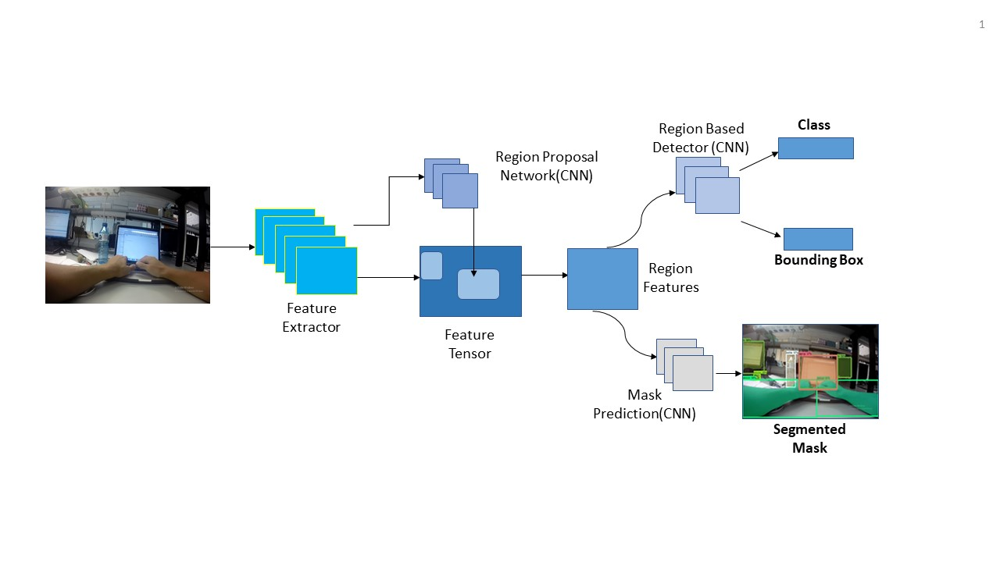
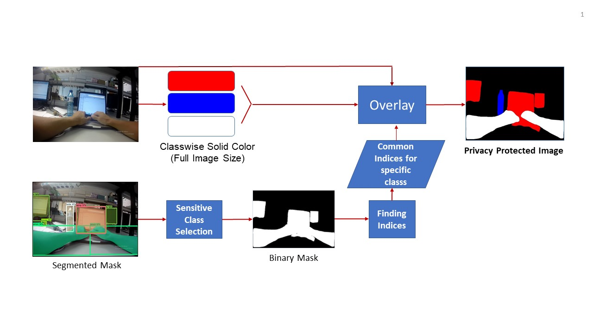
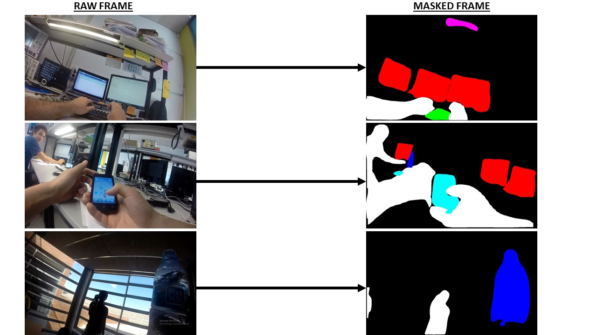

# Object-Based-Mask-Generation
Object based mask generator is used to generate mask from a video from dataset of Office activity recognition. Mainly the task of this is to differentiate the video from irrelevant background object so that network can concentrate into important objects to classify better.
It was based on Inception Resnet V2 feature extractor which performs best among all of the existed benchmarked model on COCO dataset.
Pipeline of the work is 



This is implemented on Python 3 and TensorFlow. Here 13 objects from COCO dataset has been included for segmentation as these objects are important in office activity dataset. It's based on Instance segmentation and then assign specific color to same type of objects which is almost similar for detecting same type of class.

Some example of our work 



The repository includes:
* Source code of Mask R-CNN built on Inception Resnet V2 backbone to generate masked frame/video.

* Source code of Privacy Protection. Main goal of this task to provide privacy to privacy sensitive objects in a video.
Some example of privacy protection is given in [this](https://github.com/aia39/Privacy_Protection_MASKRCNN_Resnet101) repo.


## Getting Started
1. Clone this repository
2. Install dependencies
   ```bash
   conda install -c anaconda tensorflow-gpu
   conda install -c anaconda pillow
   conda install -c anaconda opencv
   conda install -c anaconda matplotlib
   ``` 
3. Download pre-trained weights,classes names and related file from the [Tensorflow model zoo](https://github.com/tensorflow/models/blob/master/research/object_detection/g3doc/detection_model_zoo.md). Download 'mask_rcnn_inception_resnet_v2_atrous_coco' from 'COCO-trained models' table. Put the .rar file in 'object_detection' folder. You can also download other models which gives mask as output. We select inception_resnet_V2 as it gives better result though computationally expensive.

4.Create two folders in 'object_detection' folder 'test_directory_folder', 'protected_directory_folder' respectively for test videos and protected videos.

5. Run the 'masking.py' in command window from 'object_detection' folder to generate masked video/frame.
 ```bash
   python masking.py
   ```

6. (Extra) Run the 'protected.py' in command window from 'object_detection' folder generate privacy protected video/frame.
 ```bash
   python protected.py
   ```
You can follow [Mask_RCNN_Dependencies Installation](https://github.com/tensorflow/models.git) to install every dependency required for this project. 


## Requirements
Python 3.4, TensorFlow 1.3,anaconda,opencv and other common packages.

## Dataset 
* This was FPV-O office dataset given in an open competition name [Video and Image Processing Cup 2019](https://signalprocessingsociety.org/get-involved/video-image-processing-cup)
* Details about dataset can be found from this [paper](https://www.researchgate.net/publication/331177449_A_first-person_vision_dataset_of_office_activities)

## Related Works
* You can see related works and projects on which we worked from [VIP Cup 2019](https://signalprocessingsociety.org/get-involved/video-image-processing-cup) where we placed 2nd Runners Up.Our team 'BUET Synapticans',we are undergrad students of Bangladesh University of Engineering and University.

* Privacy protection using different framework.[Privacy_Protection_MASKRCNN_Resnet101](https://github.com/aia39/Privacy_Protection_MASKRCNN_Resnet101), [Privacy_Protection_MaskRCNN_InceptionV2](https://github.com/aia39/Privacy_Protection_MaskRCNN_InceptionV2)

## Acknowledgement 
Tons of code was downloaded from theirs repo
https://github.com/tensorflow/models
    
